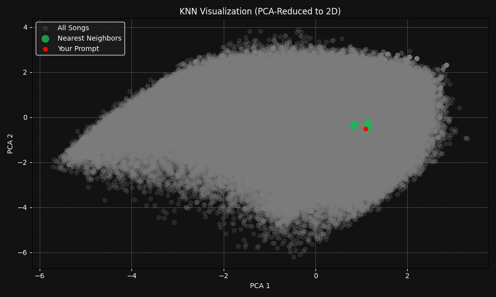

## What is it? / How do I use it? 
SoundsLike is a music recommendation system that takes your natural language prompts to suggest songs you might like. It combines a specified song, artist, or mood to find new music with similar characteristics.

Simply enter a prompt, adjust the number of recommendations you want, and get new songs that sound like your input!

**Example**: *"Chill songs like Solar by Inner Wave"* 

## Behind the scenes 
SoundsLike utilizes Natural Language Processing (NLP) for understanding user queries and Machine Learning (ML) techniques, such as embeddings, K-Nearest Neighbors (KNN), and K-Means clustering, to find and visualize similar songs.

* It first uses Natural Language Processing (NLP) with a fine-tuned Named Entity Recognition (NER) model to understand your prompt and identify entities like the song, artist, or mood.
* The system then creates a temporary vector that numerically represents your input. This is done by finding a vector for the input song and artist (using a SentenceTransformer model) and combining it with a vector for the input mood.
* It then uses K-Nearest Neighbors (KNN) to find songs in the dataframe that have a vector closest to your input vector.
* Finally, the system visualizes the results by displaying the qualities of your input song versus the recommended songs in a radar chart and a 2D plot.

 
